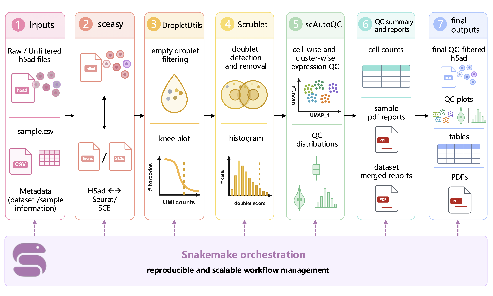

# scSIEVE-QC

**scSIEVE-QC** 全称为 **single-cell Snakemake-Integrated Empty-droplet filtering, doublet Verification, and Expression-quality Evaluation for Quality Control**。

scSIEVE-QC 是一个基于 Snakemake 的单细胞 RNA-seq 质控流程，整合了：

- **DropletUtils**：过滤 empty droplets / 空液滴
- **Scrublet**：检测并去除 doublets / 双细胞
- **scAutoQC / sctk**：自动化细胞级和聚类级表达质量评估
- **Snakemake**：流程编排和可复现运行

流程以每个样本的 raw/unfiltered `h5ad` 文件作为输入，输出过滤后的对象、QC 图、细胞数统计、样本级 PDF 报告和 dataset 级合并报告。

---

## 流程框架图

<p align="center">
  
</p>

---

## 流程概览

每个样本依次经过：

1. **h5ad 转 Seurat**  
   将原始 `h5ad` 转换为 Seurat RDS。

2. **Seurat 转 SingleCellExperiment**  
   为 DropletUtils 准备 `SingleCellExperiment` 对象。

3. **DropletUtils 空液滴过滤**  
   计算 barcode-rank 统计，运行 `emptyDrops`，生成 knee plot，并根据 UMI 阈值策略保留细胞。

4. **Seurat 转 h5ad**  
   将 DropletUtils 过滤后的 Seurat 对象转回 `h5ad`。

5. **Scrublet 去双细胞**  
   计算 doublet score，生成 Scrublet histogram，并去除预测双细胞。

6. **scAutoQC 表达质量评估**  
   计算 QC 指标，进行 cell-wise 和 cluster-wise QC，输出 QC UMAP、分布图和最终过滤后的 `h5ad`。

7. **细胞数统计**  
   统计 DropletUtils、Scrublet、scAutoQC 后保留的细胞数。

8. **样本级报告**  
   生成每个样本的 PDF QC 报告。

9. **dataset 级报告**  
   合并同一 dataset 下所有样本的 PDF 报告。

---

## 项目结构

```text
scSIEVE-QC/
├── README.md
├── README_zh.md
├── LICENSE
├── .gitignore
├── assets/
│   └── scSIEVE-QC_framework.png
├── config/
│   ├── config.yaml
│   └── sample.csv
├── examples/
│   └── sample.csv
└── workflow/
    ├── Snakefile
    ├── envs/
    │   ├── sceasy.yaml
    │   └── scautoqc.yaml
    └── scripts/
        ├── 00.from_h5ad_to_seurat.r
        ├── 01.from_seurat_to_sce.r
        ├── 02.DropletUtils.r
        ├── 03.from_seurat_to_h5ad.r
        ├── 04.Scrublet.py
        ├── 05.scAutoQC.py
        ├── 06.Count_cells.py
        ├── 07.merge_cell_counts.py
        ├── 08.Generate_sample_report.py
        └── 09.merge_dataset_reports.py
```

大型输入数据和运行结果不会放入 GitHub 仓库。

---

## 输入文件

准备一个样本表，至少包含三列：

```csv
dataset,sample,file
Example_2024,sample1,/path/to/sample1_counts_unfiltered.h5ad
Example_2024,sample2,/path/to/sample2_counts_unfiltered.h5ad
```

| 列名 | 说明 |
|---|---|
| `dataset` | 数据集名称。同一 dataset 的样本会生成 dataset 级汇总。 |
| `sample` | 样本名称。 |
| `file` | raw/unfiltered 输入 `h5ad` 文件路径，建议使用绝对路径。 |

默认样本表为：

```text
config/sample.csv
```

也可以在 `config/config.yaml` 中指定其他样本表。

---

## 配置文件

主配置文件：

```text
config/config.yaml
```

主要参数：

```yaml
sample_table: "config/sample.csv"
outdir: "results"

envs:
  sceasy: "workflow/envs/sceasy.yaml"
  scautoqc: "workflow/envs/scautoqc.yaml"

scrublet:
  expected_doublet_rate: 0.06
  threshold: 0.4

scautoqc:
  min_genes: 200
  n_counts_max_quantile: 0.95
```

---

## 安装

先安装 Snakemake，例如：

```bash
conda create -n snakemake -c conda-forge -c bioconda snakemake
conda activate snakemake
```

然后使用 Snakemake 自动管理 conda 环境运行：

```bash
snakemake -s workflow/Snakefile --use-conda --cores 8
```

### 关于 `sceasy`

R 包 `sceasy` 在不同 conda channel 中可用性可能不同。如果 `workflow/envs/sceasy.yaml` 创建的环境中没有 `sceasy`，可以进入该环境后按照上游说明安装，例如：

```bash
Rscript -e 'remotes::install_github("cellgeni/sceasy")'
```

---

## 运行方式

### 1. 编辑样本表

```bash
cp examples/sample.csv config/sample.csv
# 修改 config/sample.csv 中的 dataset/sample/file
```

### 2. 预运行，不真正执行

```bash
snakemake -s workflow/Snakefile \
  --configfile config/config.yaml \
  --use-conda \
  --cores 8 \
  -n
```

### 3. 正式运行

```bash
snakemake -s workflow/Snakefile \
  --configfile config/config.yaml \
  --use-conda \
  --cores 8 \
  --rerun-incomplete
```

### 4. 打印每一步 shell 命令

```bash
snakemake -s workflow/Snakefile \
  --configfile config/config.yaml \
  --use-conda \
  --cores 8 \
  --rerun-incomplete \
  -p
```

### 5. 中断后解锁

```bash
snakemake -s workflow/Snakefile --unlock
```

---

## 输出结果

默认输出目录：

```text
results/
```

主要输出子目录：

```text
results/00.from_h5ad_to_seurat/
results/01.from_seurat_to_sce/
results/02.DropletUtils/
results/03.from_seurat_to_h5ad/
results/04.Scrublet/
results/05.scAutoQC/
results/06.Count_cells/
results/07.merge_cell_counts/
results/08.Generate_sample_report/
results/09.merge_dataset_reports/
```

常用最终结果：

| 输出 | 路径模式 |
|---|---|
| 最终过滤后的 h5ad | `results/05.scAutoQC/{dataset}/{dataset}_{sample}_scAutoQC_adata.h5ad` |
| 单样本细胞数表 | `results/06.Count_cells/{dataset}/{dataset}_{sample}_cell_counts.tsv` |
| dataset 细胞数汇总 | `results/07.merge_cell_counts/{dataset}_all_samples_cell_counts.tsv` |
| 单样本 PDF 报告 | `results/08.Generate_sample_report/{dataset}/{dataset}_{sample}_report.pdf` |
| dataset 合并 PDF 报告 | `results/09.merge_dataset_reports/{dataset}_all_samples_report.pdf` |

---

## 引用

如果使用 scSIEVE-QC，请根据需要引用底层工具：

- Snakemake
- DropletUtils
- Scrublet
- scAutoQC / sctk
- Seurat
- Scanpy

---

## 许可证

本项目使用 MIT License，详见 `LICENSE`。
